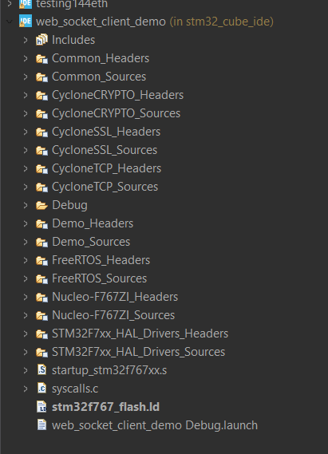

## Project Setup
1. **Download and install STM32CubeIDE**  
https://www.st.com/en/development-tools/stm32cubeide.html

<br>

3. **Clone this repository - may need to use git bash**  
   Replace my_cloned_folder with any directory of your choice
  ```bash
  git clone https://github.com/rsx-electrical/STM32-ethernet.git my_cloned_folder
  ```

<br>
Alternatively, use Github Desktop to clone  

3. **Open the project in STM32CubeIDE**
- Open your file explorer and navigate to: my_cloned_folder\rsx_ethernet\demo\st\nucleo_f767zi\web_socket_client_demo\stm32_cube_ide
- Click on the .cproject file to open your project in STM32CubeIDE
- Should look like this in your IDE's Project Explorer:

<div align="center">

</div>

<br>

4. **Build and flash the firmware**
- Connect the NUCLEO-F767ZI via USB
- Press Ctrl + B to build
- Click Debug to start a debug session (recommended) or flash the firmware

<br>

5. **Monitor serial output**
- Open a UART terminal (e.g. [Termite](https://www.npackd.org/p/com.compuphase.Termite/3.4)) at 115200 baud to see debug messages
- Useful to see startup logs and network status after setting up the network and server (see next two sections)

<br>

## Network Setup
To connect directly, static IPs must be assigned manually. On Windows 11, open Settings>Network & Internet>Ethernet, click to Edit IPv4 settings and change the following:

IPv4          -> On <br>
IP Address    -> 192.168.0.10 <br>
Subnet Mask   -> 255.255.255.0 <br>
Preferred DNS -> 8.8.8.8 <br>
Alternate DNS -> 8.8.8.4 <br>

Note that these values can be configured in main.c in stm32_project/src.
Both devices must be on the same subnet.  

<br>

## Example WebSocket Server (Python)
First, connect to the board with an Ethernet cable. You can verify the Ethernet connection by opening PowerShell and running:
```bash
ping 192.168.0.20
```

A successful connection will display
```bash
Pinging 192.168.0.20 with 32 bytes of data:
Reply from 192.168.0.20: bytes=32 time=2ms TTL=64
Reply from 192.168.0.20: bytes=32 time=2ms TTL=64
Reply from 192.168.0.20: bytes=32 time=1ms TTL=64
Reply from 192.168.0.20: bytes=32 time=1ms TTL=64

Ping statistics for 192.168.0.20:
    Packets: Sent = 4, Received = 4, Lost = 0 (0% loss),
Approximate round trip times in milli-seconds:
    Minimum = 1ms, Maximum = 2ms, Average = 1ms
```

### To run the server:
Install the Python package:
```bash
pip install websockets
```

Run the server:
```bash
python server.py
```

### Expected outputs:
Press the USER button (blue pushbutton on the board) to initiate the WebSocket connection.


**Python terminal**
```bash
Server running on ws://192.168.0.10:8080
Connected!!!!
TEST:  Hello World!
```

Pushing the USER button again should now display
```bash
TEST:  User button pressed!
```

**STM32 UART terminal (115200 baud)**
```bash
WebSocket: Resolving server name...

WebSocket: Connecting to server...
WebSocket: Connected to server
WebSocket: Sending message (12 bytes)...
  Hello World!
WebSocket: Message received (7 bytes)...
  FINALLY
WebSocket: Message received (17 bytes)...
  ACK: Hello World!
```

<br>

## Next Steps
Unfortunately, no .ioc file was included with the original demo. This means the STM32CubeMX GUI cannot be used to edit or reconfigure the project (e.g., pins, clocks, middleware) unless a new CubeMX project is created and manually configured. All hardware or middleware changes must therefore be made directly in the source code.

The project directory is somewhat messy since it was adapted from a large CycloneTCP demo. Most unnecessary files were removed, but the structure could still be simplified or refactored.

Finally, the WebSocket communication logic should be modified to send and receive data as needed, independent of the USER pushbutton.
